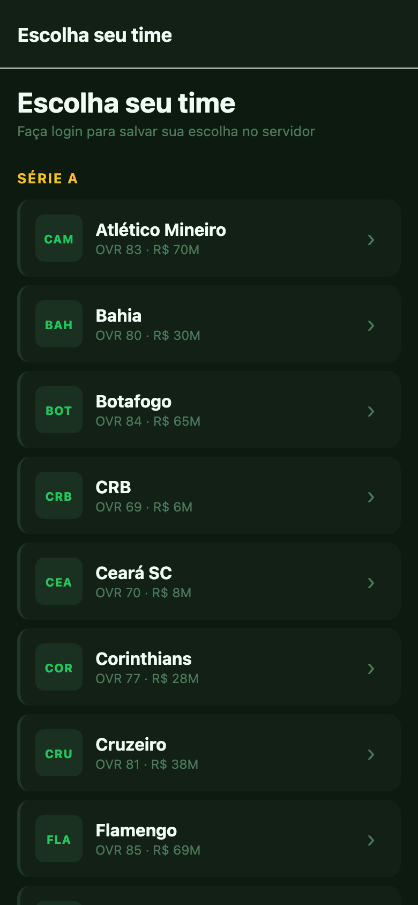
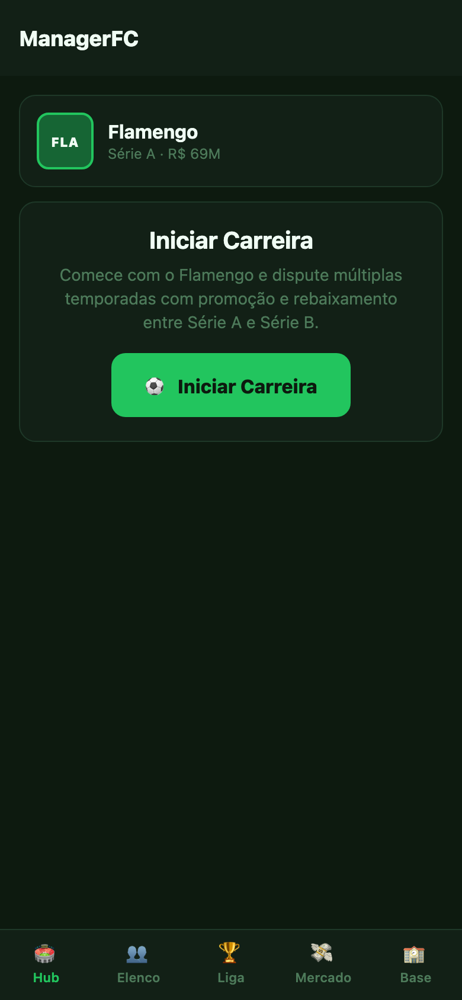
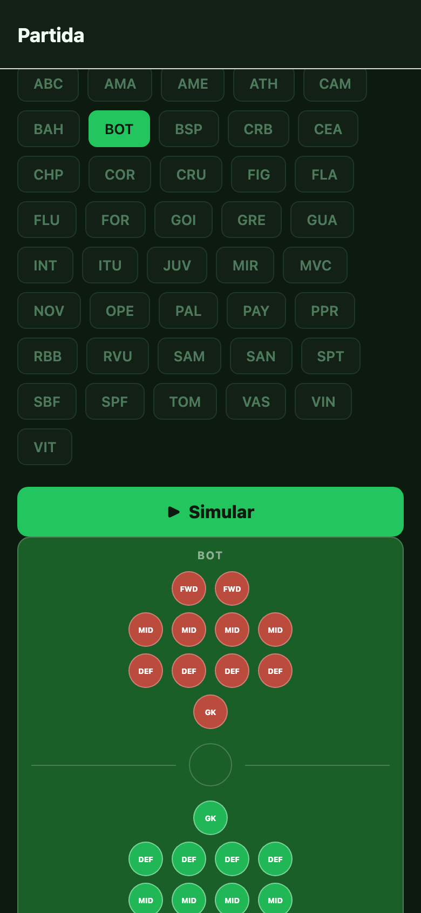
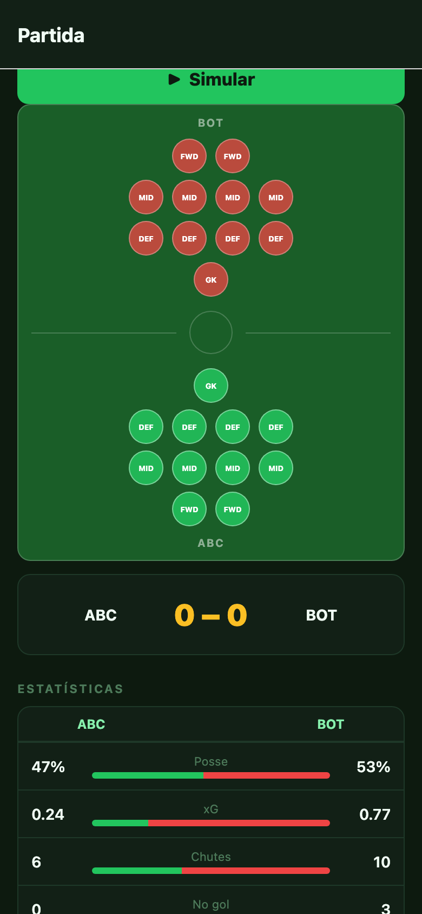
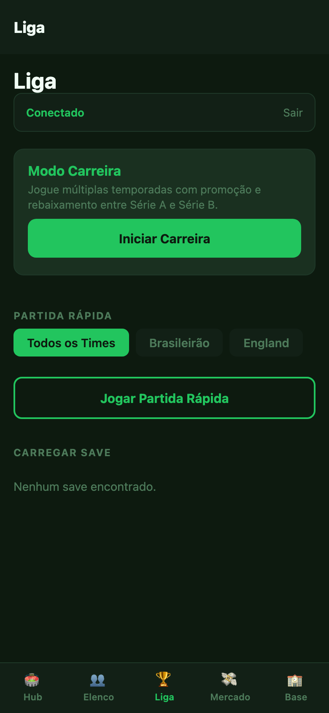
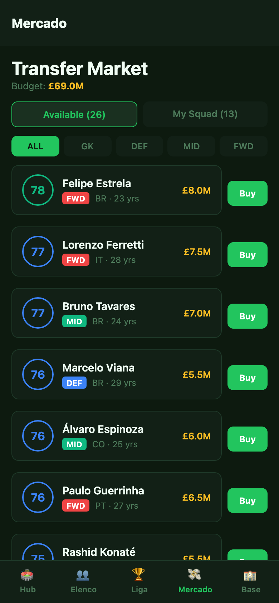
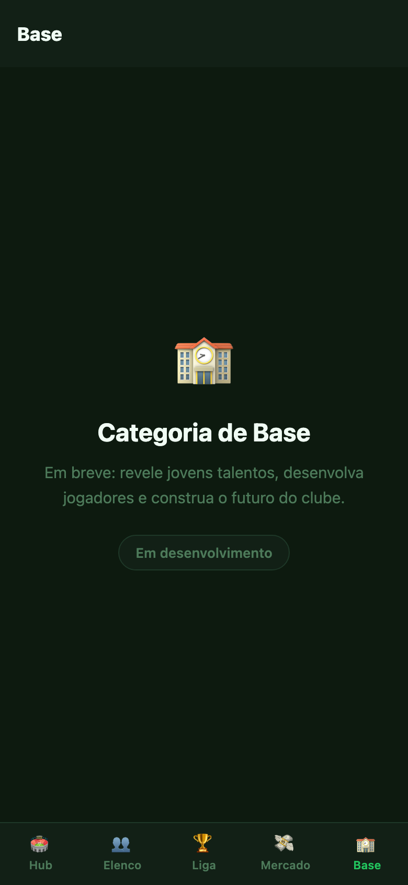

# ManagerFC

A mobile football manager game set in the Brazilian football scene. You become a manager, pick your club, simulate a full season of the **Campeonato Brasileiro Série A or Série B** with real clubs, track standings, play round by round, and save/load your progress.

Built as a portfolio project — Go REST API + React Native (Expo) mobile app.

---

## Screenshots

| Home | Seleção de time | Career Hub |
|:---:|:---:|:---:|
|  |  |  |

| Partida — campo | Partida — stats | Liga |
|:---:|:---:|:---:|
|  |  |  |

| Mercado | Categoria de Base |
|:---:|:---:|
|  |  |

---

## Features

- **Team selection** — choose any of 40 real Brazilian clubs (20 Série A + 20 Série B) to manage
- **Brasileirão simulation** — 20 clubs per division, 38 rounds, round-robin format matching the real competition
- **Match engine** — probabilistic simulation with home/away advantage and player attributes
- **Live standings table** — updated after every round, with points, wins, draws, losses, and goal difference
- **Save & load** — JWT-authenticated save-game system; multiple slots per manager
- **Manager account** — register/login with email and password; progress is tied to your account
- **Squad view** — browse your team's player roster with individual attributes
- **Cross-platform mobile app** — React Native (Expo) running on iOS, Android, and web

---

## Architecture

```
foot_manager/
├── api/        # Go + Fiber REST API  (port 8080)
│   ├── cmd/server/         # entrypoint
│   ├── internal/
│   │   ├── auth/           # JWT helpers
│   │   ├── db/             # pgx pool + embedded migrations
│   │   ├── handler/        # HTTP handlers (auth, league, squad, match, saves)
│   │   ├── league/         # season & fixture generation
│   │   ├── match/          # match simulation engine
│   │   ├── middleware/      # JWT middleware
│   │   ├── model/          # domain types
│   │   └── repository/     # Postgres queries
│   └── go.mod
├── mobile/     # React Native (Expo) — iOS / Android / Web
│   ├── app/(career)/       # career tab group (Hub, Elenco, Liga, Mercado, Base)
│   ├── app/match.tsx       # match screen (career round + standalone)
│   └── screens/            # reusable screen components
└── docker-compose.yml      # local Postgres 16
```

**API endpoints (summary):**

| Method | Path | Auth | Description |
|---|---|---|---|
| `GET` | `/health` | — | Liveness check |
| `POST` | `/api/v1/auth/register` | — | Register manager |
| `POST` | `/api/v1/auth/login` | — | Login, get JWT |
| `GET` | `/api/v1/manager/me` | JWT | My profile |
| `POST` | `/api/v1/manager/team` | JWT | Select / change club |
| `GET` | `/api/v1/squad` | optional + `?team_id` | View squad |
| `GET` | `/api/v1/teams` | — | List all clubs |
| `GET` | `/api/v1/teams/for-selection` | — | Clubs with avg OVR for picker |
| `POST` | `/api/v1/leagues` | — | Create season |
| `POST` | `/api/v1/leagues/:id/advance` | — | Advance rounds |
| `GET` | `/api/v1/leagues/:id/table` | — | Current standings |
| `POST` | `/api/v1/leagues/:id/save` | JWT | Save game state |
| `GET` | `/api/v1/saves` | JWT | List saves |
| `POST` | `/api/v1/saves/:id/restore` | — | Restore save |
| `GET` | `/api/v1/market/budget` | JWT | Team budget |
| `POST` | `/api/v1/market/buy/:id` | JWT | Buy free agent |
| `POST` | `/api/v1/market/sell/:id` | JWT | Sell squad player |
| `POST` | `/api/v1/career` | JWT | Start career |
| `POST` | `/api/v1/career/next-season` | JWT | Advance season |

---

## Stack

| Layer | Technology |
|---|---|
| Mobile | React Native, Expo Router, TypeScript |
| API | Go 1.25, Fiber v2 |
| Auth | JWT (golang-jwt/jwt v5) |
| Database | PostgreSQL 16 (pgx/v5) |
| Migrations | golang-migrate (embedded in binary) |
| Local DB | Docker Compose |

---

## Quick Start

> Full step-by-step guide (prerequisites, smoke tests, E2E flow): **[TESTING.md](TESTING.md)**

```bash
# 1 — Start the database
docker compose up -d

# 2 — Start the API (runs migrations automatically)
cd api && cp .env.example .env && go run ./cmd/server

# 3 — Start the mobile app
cd mobile && npm install && npm run web
# Opens at http://localhost:19006
```

---

## Status & Roadmap

See **[ROADMAP.md](ROADMAP.md)** for the full done/planned checklist, and
**[IDEAS.md](IDEAS.md)** for early notes still under discussion.

---

## Deploy

Deployment guide (Fly.io + EAS for mobile): **[DEPLOY.md](DEPLOY.md)**

---

## License

MIT
